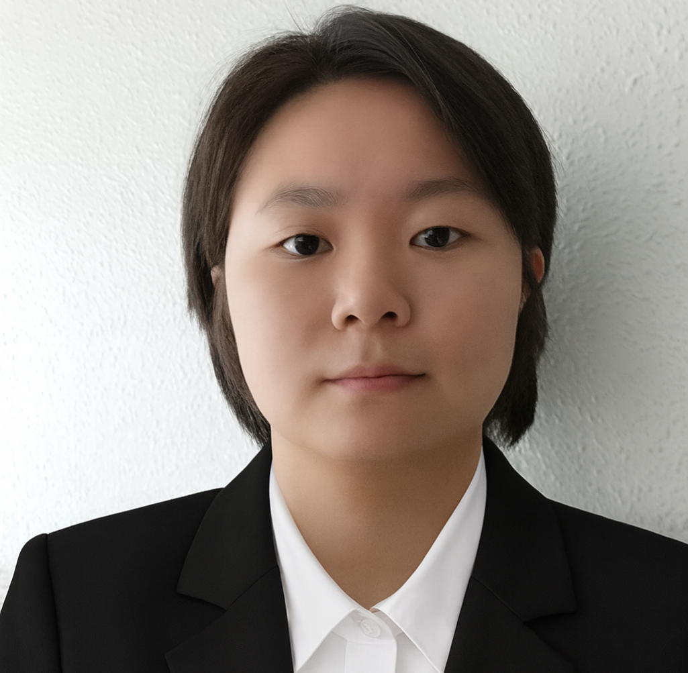

# ¡Hola! 👋 Soy Laura Gonzalo Salinas

🎓 **Estudiante de Programación / Desarrollo de Software**  
💻 Apasionada por la tecnología y la creación de aplicaciones.

---

## 👩‍💻 Sobre mí

Soy **Laura Gonzalo Salinas**, estudiante de programación con interés en crear aplicaciones modernas, eficientes y bien estructuradas. 

Actualmente estoy aprendiendo y practicando distintas tecnologías para construir software completo, abarcando tanto interfaces de usuario como lógica de negocio.

Me gusta explorar nuevos lenguajes y herramientas, mejorar mi lógica de programación y participar en proyectos que me permitan seguir creciendo como desarrolladora.

---

## 🚀 Tecnologías que estoy aprendiendo

- HTML & CSS  
- JavaScript  
- Git y GitHub  
- Bases de datos  
- Desarrollo de backend  
- …y otras áreas de desarrollo de aplicaciones (web, multiplataforma, etc.)

---

## 📚 Actualmente

- Aprendiendo nuevas tecnologías de desarrollo  
- Mejorando mis habilidades de programación  
- Trabajando en proyectos académicos

---

⭐ *Este perfil forma parte de mi aprendizaje en desarrollo de software y servirá para compartir proyectos y prácticas durante mi formación.*